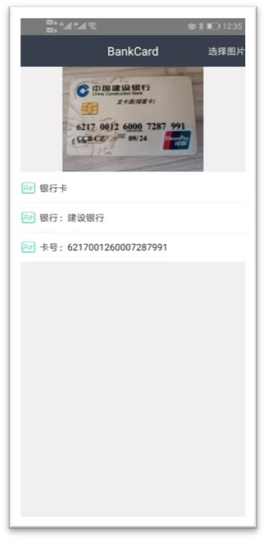

# PhotoDo
## 企业云课程项目
### 项目描述：调用人脸识别接口，建立人脸库，完成人脸检测等功能。
### 项目设计：项目分为安卓端，服务器端。
#### 安卓端：
##### 功能页面
* Detect API
    * 功能描述：人脸检测，检测照片中人物性别，年龄等属性
    * 请求参数：
        * api_key,api_secret,image_base64
    * 返回值:
        * face_token,attributes[gender,age]
    * 对应页面：DetectPhotoActivity
    * 
* Search API
    * 功能描述：检测所传人脸是否在人脸库中
    * 请求参数：
        * api_key,api_secret,image_base64
    * 返回值:
        * face_token,confidence
    * 对应页面：CompareFaceActivity
    * 
* facialfeatures API
    * 功能描述：检测所传人脸五官属性特点。
    * 请求参数：
        * api_key,api_secret,image_base64
    * 返回值:
        * result,face,nose,eye,eyebrow,mouth
    * 对应页面：FaceFeatureActivity
    * 
* OCRIDCard API
    * 功能描述：检测和识别中华人民共和国第二代身份证的关键字段内容
    * 请求参数：
        * api_key,api_secret,image_base64
    * 返回值:
        * address,birthday,gender,id_card_number,name,race
    * 对应页面：DetectOrcCardActivity
    * 
* OCRBankCard API
    * 功能描述：检测和识别各类银行卡，并返回银行卡卡片边框坐标、银行卡号码。
    * 请求参数：
        * api_key,api_secret,image_base64
    * 返回值:
        * bound,number,bank,organization
    * 对应页面：DetectOrcCardActivity
    * 
* UserLogin
    * 功能描述：实现用户登录功能
    * 请求参数：
        * username,userpwd
    * 返回值:
        * result,username
    * 对应页面：UserLoginActivity
    * 
* UserRegister
    * 功能描述：实现用户注册功能
    * 请求参数：
        * username,userpwd
    * 返回值:
        * result,username
    * 对应页面：UserRegisterActivity
    * 
* FacesetGetDetail API
    * 功能描述：查看人脸库中人脸的数量等信息
    * 请求参数：
        * api_key,api_secret,faceset_token
    * 返回值:
        * display_name,user_data,face_count,face_tokens
    * 对应页面：FaceStorgeActivity
* FaceSetAddFace API
    * 功能描述：查看人脸库中人脸的数量等信息
    * 请求参数：
        * api_key,api_secret,image_base64
    * 返回值:
        * face_added,face_count,failure_detail
    * 对应页面：FaceStorgeActivity
    * 
##### 其他页面
* 欢迎页
    * 功能描述：显示项目相关信息
    * 对应页面：WelcomeActivity
      * 
* 主页面
    * 功能描述：由三个Fragment组成项目整体页面，架构
    * 对应页面：人脸识别 HandleFragment
    * 
    * 对应页面：图形识别 StorgeFragment
    * 
    * 对应页面：用户中心 CentreFragment
    * 

